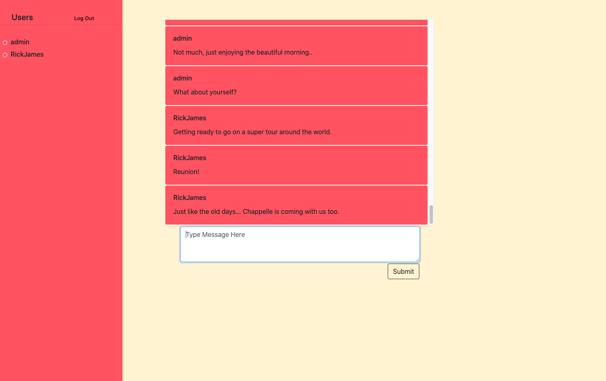

# The Gab  

Chat application inspired by Slack and Facebook.  Users can create an account and chat with other users in the main chat channel.

## Summary

I have always been fasinated with how chat applicatiions work since my earliest internet experience with AOL chat rooms.   

I used React.js to handle the client-side and React-Router library for handling routhing between React components. For styling, I chose a mix of css and Bootstrap because Bootstrap's library which adds screen responsiveness and is uses flexbox for dynamic element size changes. I also added several css edits to the Bootstrap for custimization such as container and div sizes and their positioning along with media quiries for screen break points.  

The back-end of my application was built with C# .NET Core which has been a wonderful framework for seprerating client and server-side buisiness logic.  HTTP requests are made from the client-side and sent to the internal API endpoints in a controller.  From there, the controller connects to services which then make the appropriate SQL calls to the PostgreSQL requesting or posting data back from and to the front-end.  For the SQL calls I had some help from Npgsql, which allows access to the PostgreSQL server for programs written in C#.  For unit testing, I used Nunit framework to perform tests on important functionalities such as creating a new user, and sending a new message.

See my deployed version on Azure - [The Gab](https://reidchatapp.azurewebsites.net)

## Tech Stack Used
---
* Back-End
    * ASP.NET Core 3.1
    * Npgsql
    * PostgreSQL
    * NUnit
* Front-End
    * React.js
    * Axios
    * Bootstrap

## Installation Instructions

1.) Do a fork and clone of the repo to your local machine.

2.) Navigate to the `client` directory and run `npm install`.

3.) Move to the project root directory and run `dotnet watch run`.

## Author 

* **Reid Muchow** - *Full-Stack Web Developer* - [Website](https://www.reidmuchow.com) | [LinkedIn](https://www.linkedin.com/in/reidmuchow/)
